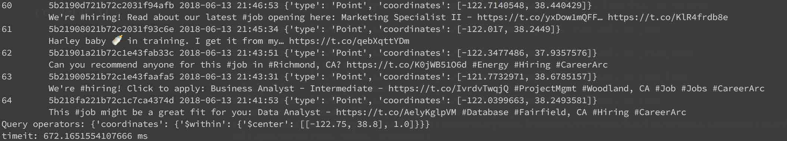

# twitter_api_practice

## Installation
From [PyPi](https://pypi.python.org/pypi/kubernetes/) directly:
```
git clone git@github.com:yusenjeng/twitter_api_practice.git
cd twitter_api_practice
pip install -r requirements.txt
```

* A proper config.py file for accessing third party services is necessary

## Execution

#### Create a continuous tweets consuming task:
```
python crawler.py -lon <longitude> -lat <latitude>
```

Example:
```
# Stream the data from the earth's surface and store them into the remote database
python crawler.py

# From specific location
python crawler.py -lon -122.75 -lat 36.8
```
You may see something like this:


#### Query the tweets form remote database:
```
python query.py -k <keywords> -lon <longitude> -lat <latitude> -r <radius in miles>
```

Example:
```
python query.py -k "NBA"
python query.py -lon -122.75 -lat 36.8 -r 10
python query.py -lon -122.75 -lat 36.8 -r 1
```
The program returns two query results in this case. It also measures the time spent on the query and shows the operators used this time.



#### Database management:
```
# Clear all tweets documents
python3 remotedb.py clear


# Create indices on collection tweets
python3 remotedb.py index
```


